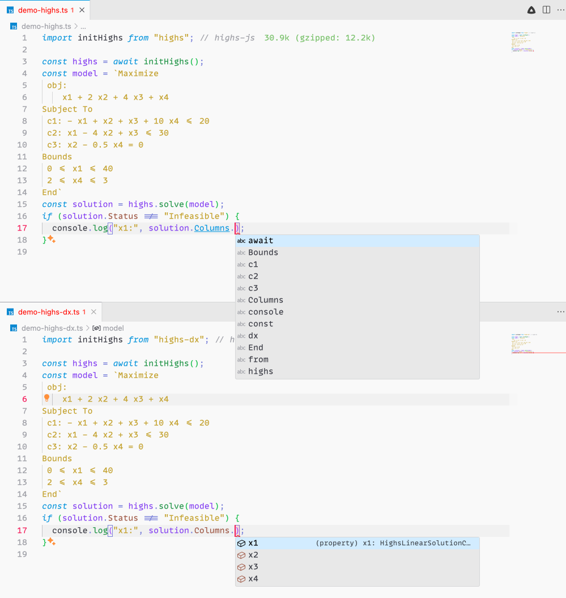
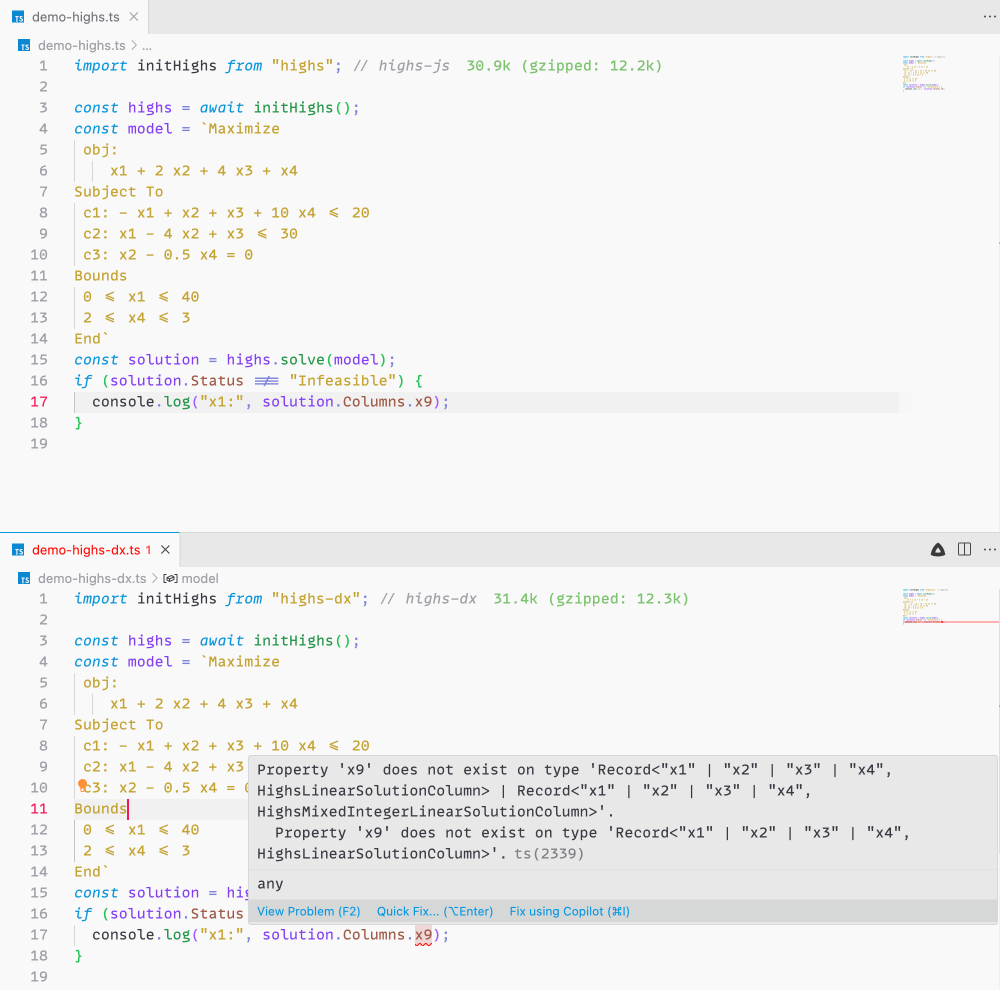

# README


`highs-dx` enhances the developer experience of using [HiGHS](https://highs.dev/) in TypeScript by adding an extra layer of type safety on top of the features provided by [highs-js](https://github.com/lovasoa/highs-js). With `highs-dx`, you gain **typesafe access** to solution variables, meaning the **TypeScript compiler** will catch any attempt to reference undefined variables in your model. Additionally, your **IDE** will offer relevant and accurate auto-completions for all defined variables, streamlining the coding process.

### Code Completion

In the image below, the code in the top pane shows a model integrated with
**highs-js**. As you can tell, VSCode informs you that, as it comes to
completion, your guess is as good as his. However, in the code right beneath,
the code that is integrated with **highs-dx**, VSCode is able to tell that the
only variables in the model are x1, x2, x3, and x4.



### Compiler Support

In the **highs-js** case, there is nothing preventing you from referring to
variables that are not defined by the model. In the **highs-dx** case however,
the _TypeScript compiler_ will prevent you from referring to undefined model
variables.



Currently, this library is a drop-in replacement for
[highs-js](https://github.com/lovasoa/highs-js). It works exactly the same; it just sprinkles some type fairy dust on top of it.

## Usage

```shell
npm install highs-dx
```

This project exports a default function for creating an instance of Highs. You
use it in _exactly_ the same way as
[highs-js](https://github.com/lovasoa/highs-js?tab=readme-ov-file#usage).

## FAQ

### Why is this a separate project?

It doesn't have to be, but there's no free ride. Adding typesafety to model
variable references requires quite a bit of typescript magic, which might impact
your compilation times. Additionally, highs-dx is not fully battle-tested; larger models may expose unforeseen limitations, so please use it with caution.

### The parser doesn't seem very accurate. Why is that?

The CPLEX LP format is quite permissive, which complicates exact type representation of the AST. At times, TypeScript may default to any due to complexity limitations. To improve reliability, I switched to a pattern-matching approach rather than strict parsing of the AST. This workaround is generally effective, though accuracy in all scenarios cannot yet be guaranteed.
